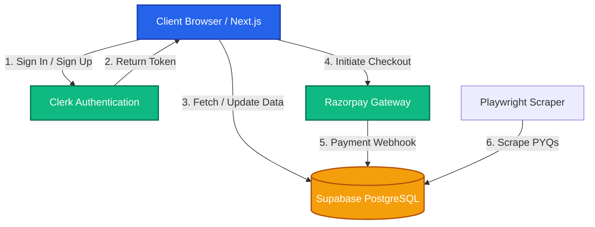

<div align="center">

# 🎓 CET Mentor Hub

**Your ultimate companion for Common Entrance Test (CET) Preparation**

[](https://cet-mentor-hub.vercel.app/)
[]()
[]()
[]()
[]()

[Features](#-features) • [Tech Stack](#-tech-stack) • [Architecture](#-architecture--flow) • [Getting Started](#-getting-started) • [Contributing](#-contributing)

</div>

---

## 📖 About The Project

**CET Mentor Hub** is a dynamic web application designed to help students master their Common Entrance Test (CET) preparations. The platform provides access to Previous Year Questions (PYQs), progress tracking, mock tests, and personalized mentoring.

### ✨ Features
- **Secure Authentication**: Passwordless & social login via Clerk.
- **Progress Tracking**: Real-time analytics and charts using Recharts.
- **Previous Year Questions (PYQs)**: Dedicated scraper and viewer for past exam questions.
- **Secure Payments**: Integrated with Razorpay for premium mock tests or mentorships.
- **Interactive UI**: Beautiful, accessible, and responsive components built with Radix UI, Framer Motion, and Tailwind CSS.
- **Email Notifications**: Automated updates and alerts via Resend.

---

## 🛠 Tech Stack

| Category | Technology |
| :--- | :--- |
| **Frontend** | Next.js 16 (App Router), React 19, TypeScript |
| **Styling** | Tailwind CSS v4, Radix UI (Shadcn), Framer Motion |
| **Backend & DB** | Supabase (PostgreSQL) |
| **Authentication** | Clerk |
| **Payments** | Razorpay |
| **Emails** | Resend |
| **Data Visualization**| Recharts |
| **Scraping** | Playwright, Cheerio, Axios |

---

## 🏗 Architecture & Flow

The following flow chart explains the high-level architecture of how the frontend, authentication, and database interact:



---

## 🚀 Getting Started

Follow these instructions to set up the project locally.

### Prerequisites
Make sure you have [Node.js](https://nodejs.org/) (v22+ recommended) and `npm` installed.

### Installation

1. **Clone the repository:**
   ```bash
   git clone https://github.com/GaneshSarode/cet-mentor-hub.git
   cd cet-mentor-hub
   ```

2. **Install dependencies:**
   ```bash
   npm install
   ```

3. **Set up Environment Variables:**
   Create a `.env.local` file in the root directory and add your API keys:
   ```env
   # Clerk Auth
   NEXT_PUBLIC_CLERK_PUBLISHABLE_KEY=your_clerk_key
   CLERK_SECRET_KEY=your_clerk_secret

   # Supabase
   NEXT_PUBLIC_SUPABASE_URL=your_supabase_url
   NEXT_PUBLIC_SUPABASE_ANON_KEY=your_supabase_anon_key

   # Razorpay
   NEXT_PUBLIC_RAZORPAY_KEY_ID=your_razorpay_key
   RAZORPAY_KEY_SECRET=your_razorpay_secret
   
   # Resend
   RESEND_API_KEY=your_resend_key
   ```

4. **Run the Development Server:**
   ```bash
   npm run dev
   ```
   Open [http://localhost:3000](http://localhost:3000) with your browser to see the result.

---

## 🕷️ PYQ Scraper

This project includes a custom Playwright scraper inside `scripts/scrape-pyq/` to fetch past examination questions.
To run the scraper:
```bash
cd scripts/scrape-pyq
npm install
node scrape_examside.js
```

---

## 🤝 Contributing

Contributions are what make the open-source community such an amazing place to learn, inspire, and create. Any contributions you make are **greatly appreciated**.

1. Fork the Project
2. Create your Feature Branch (`git checkout -b feature/AmazingFeature`)
3. Commit your Changes (`git commit -m 'Add some AmazingFeature'`)
4. Push to the Branch (`git push origin feature/AmazingFeature`)
5. Open a Pull Request

---

## 📜 License

Distributed under the MIT License. See `LICENSE` for more information.

---

<div align="center">
  Made with ❤️ by <a href="https://github.com/GaneshSarode">Ganesh Sarode</a>
</div>
