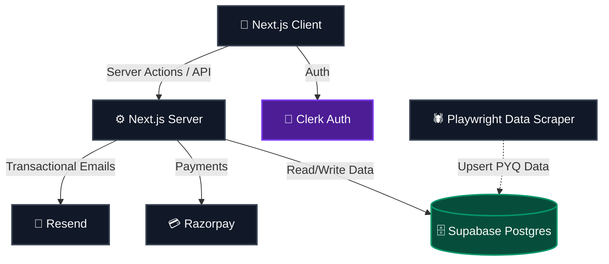

<div align="center">
  <h1>🎯 CET Mentor Hub</h1>
  <p><strong>Free MHT-CET guidance platform for Maharashtra students</strong></p>

  <p>
    <a href="https://cet-mentor-hub.vercel.app"><strong>Live Demo</strong></a> · 
  </p>
    <a href="https://github.com/GaneshSarode/cet-mentor-hub/issues"><strong>Report Bug</strong></a> · 
    <a href="https://github.com/GaneshSarode/cet-mentor-hub/pulls"><strong>Contribute</strong></a>
  </p>

  <p>
    
    
    
    
    <br/>
    
    
    
    
  </p>
</div>

---

## 🌟 About the Project

**CET Mentor Hub** is a comprehensive, student-first platform designed to democratize access to high-quality MHT-CET preparation. Built by a VJTI student who scored in the **99.21%ile**, this platform connects aspirants with top-tier resources, real exam-like experiences, and direct 1:1 mentorship from seniors who have already cracked the code.

### ✨ Key Features

- 🎓 **1:1 VJTI Mentorship:** Direct guidance and strategy sessions with current VJTI students.
- 🔮 **College Predictor:** Advanced algorithm leveraging historical CAP cutoff data to predict college admissions.
- 📝 **Live PYQ Tests (2019–2025):** Time-bound, auto-graded Previous Year Question mock exams mimicking the actual CBT environment.
- 🏆 **Global Leaderboard:** Competitive ranking system to track your progress against peers across Maharashtra.
- 🏛️ **College Explorer:** In-depth directories and insights on top engineering colleges.

---

## 💻 Tech Stack

| Category | Technology |
| :--- | :--- |
| **Frontend Framework** | Next.js 16, React 19 |
| **Styling & UI** | Tailwind CSS v4, Radix UI, Recharts (Data Viz) |
| **Language** | TypeScript |
| **Backend & Database** | Supabase (PostgreSQL with RLS) |
| **Authentication** | Clerk Auth |
| **Payments & Emails** | Razorpay, Resend |
| **Data Automation** | Playwright (Automated PYQ Scraper) |
| **Deployment** | Vercel |

---

## 🏗️ Architecture Overview



---

## 🚀 Getting Started

To get a local copy up and running, follow these simple steps.

### Prerequisites
- Node.js (v18+)
- npm or yarn or pnpm
- Supabase Account
- Clerk Account

### Installation

1. **Clone the repo**
   ```bash
   git clone https://github.com/GaneshSarode/cet-mentor-hub.git
   cd cet-mentor-hub
   ```

2. **Install dependencies**
   ```bash
   npm install
   # or yarn install / pnpm install
   ```

3. **Set up Environment Variables**
   Create a `.env.local` file in the root directory and add your keys:
   ```env
   NEXT_PUBLIC_CLERK_PUBLISHABLE_KEY=pk_test_...
   CLERK_SECRET_KEY=sk_test_...
   NEXT_PUBLIC_SUPABASE_URL=https://your-project.supabase.co
   NEXT_PUBLIC_SUPABASE_ANON_KEY=eyJhb...
   SUPABASE_SERVICE_ROLE_KEY=eyJhb...
   ```

4. **Start the development server**
   ```bash
   npm run dev
   ```
   *Your app will be running at `http://localhost:3000`*

---

## 🕷️ PYQ Scraper Usage

The repository includes a highly robust Playwright scraper used to automatically extract and format MHT-CET Previous Year Questions from the web to populate our Supabase instance.

To run the scraper:
1. Navigate to the scraper directory:
   ```bash
   cd scripts/scrape-pyq
   ```
2. Ensure you have the necessary dependencies (Node/Playwright or Python depending on the script format):
   ```bash
   npm install playwright
   ```
3. Run the targeted extraction script:
   ```bash
   node playwright_scraper_19_evening.js
   ```

---

## 🤝 Contributing

Contributions are what make the open-source community such an amazing place to learn, inspire, and create. Any contributions you make are **greatly appreciated**.

1. Fork the Project
2. Create your Feature Branch (`git checkout -b feature/AmazingFeature`)
3. Commit your Changes (`git commit -m 'Add some AmazingFeature'`)
4. Push to the Branch (`git push origin feature/AmazingFeature`)
5. Open a Pull Request

---

## 📜 License

Distributed under the MIT License. See `LICENSE` for more information.

---

<div align="center">
  <p>Made with ❤️ by <strong>Ganesh Sarode</strong> — VJTI Mumbai</p>
  <p><i>SY BTech EXTC | 99.21%ile MHTCET</i></p>
  <a href="https://github.com/GaneshSarode">GitHub</a> · <a href="https://cet-mentor-hub.vercel.app">Live Platform</a>
</div>
